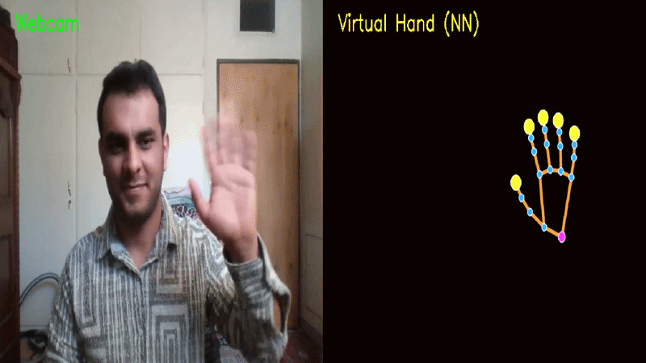

# ✋ Real-Time Hand Tracking & Virtual Hand Visualization

A Computer Vision project that performs real-time hand detection and tracking using MediaPipe Hand Landmarker and OpenCV.

The system captures webcam input, detects up to two hands simultaneously, applies landmark smoothing to reduce jitter, and renders a virtual neural-network-style hand representation alongside the live video stream.

---

## 🚀 Project Overview

This project demonstrates how modern AI-powered computer vision techniques can be used to perform accurate real-time hand tracking.

The application:

* Detects hands from a webcam feed
* Tracks 21 hand landmarks per hand
* Supports tracking of multiple hands
* Applies temporal smoothing for stable visualization
* Generates a virtual hand skeleton representation
* Displays real and virtual hands side-by-side

The result is a clean and intuitive visualization of hand movements that can serve as a foundation for:

* Gesture Recognition Systems
* Human-Computer Interaction (HCI)
* AR/VR Applications
* Sign Language Recognition
* Robotics Control Interfaces
* AI-Powered Interactive Systems

---

## 📷 Demo

<p align="center">
  
</p>

---

## 🏗 System Architecture

```text
Webcam Feed
      │
      ▼
OpenCV Video Capture
      │
      ▼
MediaPipe Hand Landmarker
      │
      ▼
21 Hand Landmarks Extraction
      │
      ▼
Temporal Smoothing
      │
      ▼
Virtual Hand Rendering
      │
      ▼
Side-by-Side Visualization
```

---

## 🔍 Features

### Real-Time Detection

Detects hands directly from a webcam stream.

### Multi-Hand Tracking

Supports tracking up to two hands simultaneously.

### Landmark Smoothing

Uses exponential smoothing to reduce tracking noise and jitter.

### Virtual Hand Rendering

Creates a stylized digital hand using:

* Joint landmarks
* Finger-tip highlighting
* Hand skeleton connections

### Full-Screen Visualization

Displays webcam feed and virtual hand output in a large side-by-side interface.

---

## 🧠 Technologies Used

| Technology      | Purpose                   |
| --------------- | ------------------------- |
| Python          | Core Development          |
| OpenCV          | Video Processing          |
| MediaPipe       | Hand Detection & Tracking |
| NumPy           | Numerical Operations      |
| Computer Vision | Real-Time Tracking        |

---

## 📂 Project Structure

```text
hand-tracking-project/
│
├── hand_tracking.py
├── hand_landmarker.task
│
├── images/
│   ├── banner.png
│   └── demo.gif
│
├── requirements.txt
└── README.md
```

---

## ⚙ Installation

### Clone Repository

```bash
git clone https://github.com/yourusername/hand-tracking-project.git

cd hand-tracking-project
```

### Create Virtual Environment

```bash
python -m venv venv
```

### Activate Environment

Windows:

```bash
venv\Scripts\activate
```

Linux / macOS:

```bash
source venv/bin/activate
```

### Install Dependencies

```bash
pip install -r requirements.txt
```

---

## 📦 Requirements

```text
opencv-python
mediapipe
numpy
```

---

## ▶ Run Project

```bash
python hand_tracking.py
```

Press:

```text
Q
```

to exit the application.

---

## 📊 Key Concepts Demonstrated

* Real-Time Computer Vision
* Hand Landmark Detection
* AI-Based Tracking
* Human Pose Estimation
* Signal Smoothing
* OpenCV Visualization
* MediaPipe Tasks API

---

## 🎯 Future Improvements

* Hand Gesture Recognition
* Finger Counting
* Sign Language Detection
* Gesture-Based Mouse Control
* AR Interaction Systems
* Deep Learning Gesture Classification
* Web Application Deployment

---

## 📜 License

This project is released under the MIT License.

---

## 👨‍💻 Author

Mohammad Reza Mirtaleb

MSC at Petroleum University of Technology, Abadan Faculty

AI Engineer | Machine Learning & Deep Learning Engineer | Data Scientist | NLP Expert (LLMs and VLMs) | RAG and Multi-Agent Systems Developer

Building intelligent solutions for real-world challenges.

Developed as part of an AI & Computer Vision portfolio focused on real-world machine learning and intelligent systems applications.
