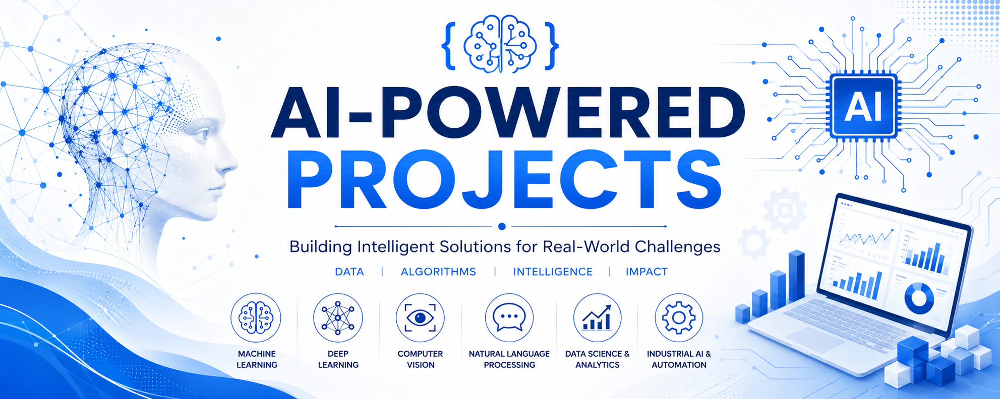

# 🚀 AI-Powered Projects

<p align="center">
  
</p>

<p align="center">
  <strong>Building Intelligent Solutions for Real-World Challenges</strong>
</p>

<p align="center">
  
  
  
  
  
</p>

---

## 📖 Overview

Welcome to **AI-Powered Projects**, a curated collection of Artificial Intelligence, Machine Learning, Deep Learning, Data Science, Natural Language Processing, Computer Vision, and Industrial AI projects.

This repository showcases practical implementations of AI technologies designed to solve real-world engineering, industrial, and business challenges. The projects range from classical machine learning solutions to modern transformer-based architectures, predictive maintenance systems, digital twins, and large language model applications.

Whether you are a student, researcher, data scientist, AI engineer, or industry professional, this repository aims to provide valuable resources, reusable code, and practical examples for learning and development.

---

## 🎯 Repository Objectives

* Demonstrate real-world AI applications
* Share machine learning and deep learning projects
* Explore industrial AI use cases
* Showcase predictive analytics solutions
* Build end-to-end data science workflows
* Develop intelligent systems for engineering challenges
* Promote best practices in AI development

---

## 📂 Repository Structure

```text
AI-Powered-Projects/
│
├── Machine-Learning/
├── Deep-Learning/
├── Computer-Vision/
├── Natural-Language-Processing/
├── Large-Language-Models/
├── Time-Series-Forecasting/
├── Predictive-Maintenance/
├── Digital-Twins/
├── Industrial-AI/
├── Data-Science/
├── MLOps/
│
├── assets/
│   └── banner.png
│
├── LICENSE
├── README.md
└── requirements.txt
```

---

## 🚀 Featured Domains

### 🤖 Machine Learning

* Regression
* Classification
* Clustering
* Ensemble Learning
* Anomaly Detection
* Feature Engineering

### 🧠 Deep Learning

* Artificial Neural Networks (ANNs)
* Convolutional Neural Networks (CNNs)
* Recurrent Neural Networks (RNNs)
* LSTM Networks
* Autoencoders
* Generative Models

### 💬 Natural Language Processing (NLP)

* Text Classification
* Named Entity Recognition
* Sentiment Analysis
* Topic Modeling
* Question Answering
* Text Summarization

### 🔥 Large Language Models (LLMs)

* Transformer Architectures
* BERT
* RoBERTa
* T5
* GPT Models
* Llama
* Mistral
* Gemma
* Qwen
* Retrieval-Augmented Generation (RAG)

### 👁️ Computer Vision

* Image Classification
* Object Detection
* Image Segmentation
* Face Recognition
* OCR Systems

### 📈 Time Series Analytics

* Demand Forecasting
* Predictive Analytics
* Sensor Data Modeling
* Industrial Process Forecasting

### 🏭 Industrial AI

* Predictive Maintenance
* Soft Sensors
* Digital Twins
* Process Optimization
* Fault Detection & Diagnosis
* Root Cause Analysis
* Asset Health Monitoring

---

## 🛠️ Technologies & Tools

### Programming & Development

* Python
* Jupyter Notebook
* Git
* GitHub

### Data Processing & Analysis

* NumPy
* Pandas
* SciPy
* Polars

### Machine Learning

* Scikit-Learn
* XGBoost
* LightGBM
* CatBoost

### Deep Learning

* TensorFlow
* Keras
* PyTorch

### Natural Language Processing

* NLTK
* spaCy
* Gensim
* Hugging Face Transformers
* Sentence Transformers
* Tokenizers

### Large Language Models

* BERT
* RoBERTa
* DistilBERT
* ALBERT
* DeBERTa
* T5
* FLAN-T5
* GPT Models
* Llama
* Mistral
* Gemma
* Qwen

### Computer Vision

* OpenCV
* YOLO
* TorchVision
* Detectron2
* Albumentations

### Generative AI & RAG

* LangChain
* LangGraph
* LlamaIndex
* FAISS
* ChromaDB

### Data Visualization

* Matplotlib
* Seaborn
* Plotly
* Bokeh

### MLOps & Deployment

* FastAPI
* Flask
* Streamlit
* Docker
* MLflow
* DVC

### Databases

* SQLite
* PostgreSQL
* MongoDB

### Cloud Platforms

* AWS
* Microsoft Azure
* Google Cloud Platform (GCP)

---

## 📊 Project Standards

Each project should include:

* Project Description
* Problem Statement
* Dataset Information
* Exploratory Data Analysis (EDA)
* Data Preprocessing
* Feature Engineering
* Model Development
* Hyperparameter Tuning
* Evaluation Metrics
* Results & Insights
* Future Improvements
* Deployment (if applicable)

---

## 🚀 Getting Started

Clone the repository:

```bash
git clone https://github.com/your-username/AI-Powered-Projects.git
cd AI-Powered-Projects
```

Install dependencies:

```bash
pip install -r requirements.txt
```

Run notebooks or project scripts according to the documentation provided within each project folder.

---

## 📚 Learning Resources

This repository covers concepts related to:

* Machine Learning
* Deep Learning
* Natural Language Processing
* Computer Vision
* Transformer Architectures
* Large Language Models
* MLOps
* Data Engineering
* Industrial AI
* Digital Twins
* Predictive Maintenance

---

## 🤝 Contributing

Contributions are welcome.

If you would like to contribute:

1. Fork the repository
2. Create a feature branch
3. Commit your changes
4. Push the branch
5. Open a Pull Request

Please ensure that your code follows best practices and includes appropriate documentation.

---

## ⭐ Support

If you find this repository useful, consider giving it a ⭐ Star.

Your support helps improve the repository and encourages future development.

---

## 📜 License

This project is licensed under the Apache License 2.0.

See the LICENSE file for details.

---

## 👨‍💻 Author

Mohammad Reza Mirtaleb

MSC at Petroleum University of Technology, Abadan Faculty

AI Engineer | Machine Learning & Deep Learning Engineer | Data Scientist | NLP Expert (LLMs and VLMs) | RAG and Multi-Agent Systems Developer

Building intelligent solutions for real-world challenges.

---

### 🌟 Building Intelligent Solutions with Artificial Intelligence
