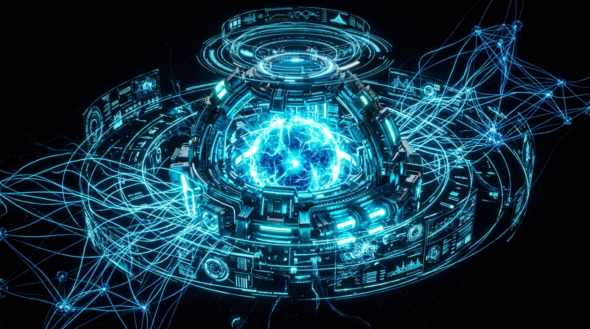

<div align="center">
  
</div>

<div align="center">
  
</div>

<p align="center">
  
  
  
  
</p>

---

## 📖 Overview

Welcome to **AI-Powered Projects**, a curated collection of Artificial Intelligence, Machine Learning, Deep Learning, Natural Language Processing, and Computer Vision solutions. 

This repository showcases practical, end-to-end implementations of AI technologies designed to solve real-world engineering, industrial, and business challenges. Whether you are a researcher, AI engineer, or data scientist, this repository provides valuable resources, reusable code, and cutting-edge architectural patterns.

---

## 🎯 Repository Objectives

- 💡 **Demonstrate** real-world AI applications and workflows.
- 🔬 **Explore** classical Machine Learning vs. modern Deep Learning.
- 👁️ **Build** state-of-the-art Computer Vision & NLP systems.
- ⚙️ **Develop** predictive analytics and intelligent industrial solutions.

---

## 📂 Repository Structure

The projects are beautifully organized by AI sub-domains. *(Note: Jarvis is a separate repository and not included here).*

```text
📁 AI-Powered-Projects/
│
├── 📁 Computer-Vision/              ← (Vision AI & Image Processing)
│   ├── 📁 FaceVision Pro/           ← (Advanced face detection & recognition)
│   ├── 📁 Hand Tracker/             ← (Real-time hand gesture tracking)
│   └── 📁 Volume Controller with AI/ ← (AI-based system volume control using gestures)
│
├── 📁 Machine-Learning/             ← (Classical ML algorithms & techniques)
│   ├── 📁 Regression/               ← (Linear, Polynomial, Ridge, Lasso)
│   ├── 📁 Classification/           ← (SVM, Decision Trees, Random Forest)
│   └── 📁 Clustering/               ← (K-Means, DBSCAN)
│
├── 📁 Deep-Learning/                ← (Neural Networks architectures)
│   ├── 📁 ANN/                      ← (Artificial Neural Networks)
│   ├── 📁 CNN/                      ← (Convolutional Neural Networks)
│   └── 📁 RNN/                      ← (Recurrent Neural Networks & LSTM)
│
├── 📁 Reinforcement-Learning/       ← (Agent-based learning models)
│   ├── 📁 Q-Learning/
│   └── 📁 Deep-Q-Networks/
│
├── 📁 NLP-and-LLMs/                 ← (Natural Language & Generative AI)
│   ├── 📁 RAG-Systems/              ← (Retrieval-Augmented Generation)
│   ├── 📁 Fine-tuned Models/        ← (Task-specific LLM adaptation)
│   ├── 📁 Multi-agent Systems/      ← (Collaborative AI agents & workflows)
│   └── 📁 Autonomous-Agents/        ← (AI Agents & Tool Calling)
│
└── 📁 Predictive-Maintenance/       ← (Industrial AI applications)
    ├── 📁 Rotating-Equipment/       ← (Vibration analysis & fault detection)
    └── 📁 Turbines/                 ← (Performance degradation forecasting)
```

---

## 🚀 Getting Started

### 1. Clone the Repository
```bash
git clone https://github.com/mohammadrezamirtaleb/AI-Powered-Projects.git
cd AI-Powered-Projects
```

### 2. Set Up Virtual Environment
It is highly recommended to use a virtual environment (`venv` or `conda`) to avoid dependency conflicts.
```bash
python -m venv venv
source venv/bin/activate  # On Windows use: venv\Scripts\activate
```

### 3. Explore & Run
Navigate into your project of choice (e.g., `Computer-Vision/Hand Tracker`) and follow the specific `README.md` or instructions provided within that sub-folder to install dependencies and run the scripts.

---

## 🤝 Contribution

Contributions are always welcome! If you have a great AI script, a predictive model, or a vision tracker you'd like to share:
1. Fork the Project.
2. Create your Feature Branch (`git checkout -b feature/AmazingAI`).
3. Commit your Changes (`git commit -m 'Add some AmazingAI'`).
4. Push to the Branch (`git push origin feature/AmazingAI`).
5. Open a Pull Request.

---

## 📜 License

Distributed under the MIT License. See `LICENSE` for more information.

<div align="center">
  <i>Developed with ❤️ for the AI Community.</i>
</div>
