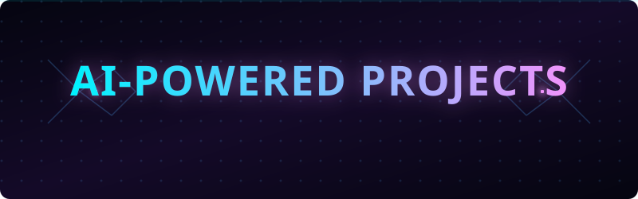

<div align="center">
  <picture>
    <source media="(prefers-color-scheme: dark)" srcset="./assets/ai-banner.svg">
    
  </picture>
</div>
<div align="center">
  
</div>

<p align="center">
  
  
  
  
</p>

---

## 📖 Overview

Welcome to **AI-Powered Projects**, the central hub for my Artificial Intelligence, Machine Learning, and Computer Vision solutions. 

This `master` branch acts as the root gateway. Because different projects have vastly different dependencies and architectures, they are maintained in their own dedicated branches or sub-directories.

> [!NOTE]
> **To see the full list of active projects, source codes, and detailed folder structures, please switch to the `ai-powered-projects` branch.**

---

## 🚀 Quick Navigation

- 👁️ **Computer Vision:** Face trackers, gesture controls, and optical recognition.
- 🧠 **Machine Learning:** Predictive analytics and industrial fault detection.
- 💬 **NLP & LLMs:** RAG systems, AI agents, and conversational models.

To explore these, switch your branch:
```bash
git checkout ai-powered-projects
```

---

## 📜 License

Distributed under the MIT License. See `LICENSE` for more information.

<div align="center">
  <i>Developed with ❤️ for the AI Community.</i>
</div>
