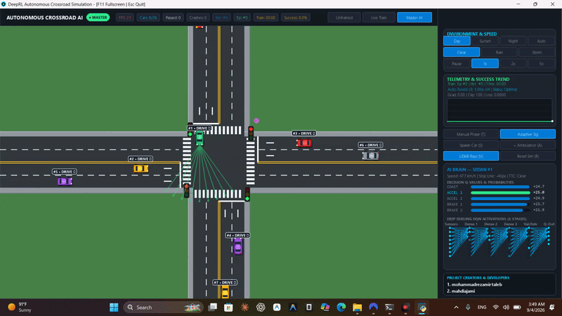

<div align="center">
  <h1>🚦 Autonomous Crossroad AI Simulation</h1>
  <p>
    
    
    
    
  </p>

  
  <br><br>
  <i>An advanced, 60 FPS, realistic 4-way intersection simulation powered by Deep Reinforcement Learning.</i>
</div>

<br>

> **Welcome to the Autonomous Crossroad Simulation!** This project demonstrates a highly complex, self-learning traffic ecosystem where vehicles use neural networks to navigate a busy intersection. From dynamic weather physics to emergency vehicle preemption, everything is simulated in real-time.

<br>

## 🧠 Core Mechanisms & Architecture

### 1. Deep Reinforcement Learning (Dueling DQN & PER)
At the heart of the vehicles is a PyTorch-powered **Dueling Deep Q-Network (DQN)**. 
* **Prioritized Experience Replay (PER):** Vehicles learn efficiently by prioritizing high-loss experiences (like crashes or near-misses).
* **Live RL Training:** Vehicles explore and learn in real-time at 15 Hz (Action Repeat = 4). You can watch them evolve from crashing chaotic drivers into safe, rule-abiding agents.
* **Reward System:** Carefully tuned to punish crashes (-50), running red lights, and excessive jerking, while rewarding smooth stops and passing intersections safely.

### 2. Machine Perception (LiDAR & Radar)
Vehicles don't cheat; they only "see" what their sensors detect:
* **9-Ray LiDAR:** Casts rays forward and diagonally to detect the distance and relative velocity of other cars and pedestrians.
* **Time-to-Collision (TTC):** Calculates the exact time remaining until impact based on closing speeds.
* **Vision Sensors:** Detects the traffic light state (Red/Yellow/Green) and distance to the stop line.

### 3. Dynamic Weather Engine & Physics
The simulation goes beyond simple movement by integrating physical constraints:
* **Weather States:** Cycles between ☀️ Clear, 🌧️ Rain, and ⛈️ Storm.
* **Friction & Hydroplaning:** Rain significantly lowers the tire friction coefficient ($\mu$), increasing stopping distances. Vehicles hitting puddles at high speed will experience hydroplaning (loss of angular control).
* **SAT Collisions:** Separating Axis Theorem (OBB) accurately calculates complex polygonal collisions and handles physical impulse spin-outs.

### 4. Smart Ecosystem (Pedestrians & Traffic Control)
* **Adaptive Traffic Lights:** Green phase durations adjust automatically based on real-time vehicle queues to dissolve traffic jams.
* **Emergency Preemption:** Ambulances force the traffic controller to grant them a green light.
* **Pedestrians:** Animated pedestrians cross dynamically on crosswalks when traffic is halted.

### 5. Cyber HUD & Neural Visualizer
The built-in UI gives you complete insight into the AI's "brain":
* Select any vehicle to see a live wireframe of its **Neural Network Layer Activations**.
* Real-time Q-Value bar charts showing exactly *why* the AI made a specific decision.
* Sparkline charts tracking the overall success rate across the intersection.

<br>

## 🎮 Controls & Keybindings

| Key | Action |
| :--- | :--- |
| <kbd>Space</kbd> | Pause / Resume Simulation |
| <kbd>1</kbd> | **Untrained Chaos Mode** (Let them crash!) |
| <kbd>2</kbd> | **Live Training Mode** (Watch them learn) |
| <kbd>3</kbd> | **Master AI Mode** (Perfect autonomous driving) |
| <kbd>W</kbd> | Toggle Weather (☀️ / 🌧️ / ⛈️) |
| <kbd>N</kbd> | Day / Night Engine Toggle |
| <kbd>A</kbd> | Spawn Emergency Ambulance |
| <kbd>S</kbd> | Spawn Random Vehicle |
| <kbd>T</kbd> | Switch Traffic Light Phase |
| <kbd>V</kbd> | Toggle Vision Rays & Sensors display |
| <kbd>R</kbd> | Reset Statistics & Crashes |
| `Mouse Click` | Click on any car to inspect its Neural Network |

<br>

## 🚀 How to Run

### Option A: 1-Click Fast Method (Windows)
Simply double-click the **`run.bat`** file to launch the graphical simulation instantly!

### Option B: Manual Execution
1. Activate your virtual environment:
   ```powershell
   .\venv\Scripts\activate
   ```
2. Install dependencies (if not already done):
   ```powershell
   pip install -r requirements.txt
   ```
3. Run the main simulation:
   ```powershell
   python src\main.py
   ```

### Option C: Fast Headless Training
If you want to train the AI rapidly without rendering the graphics, double-click **`train.bat`** or run:
```powershell
python src\train_headless.py
```

<br>

## 📁 Project Structure

```text
📦 Cross Road
┣ 📂 assets/                 # Screenshots and animated banners
┣ 📂 src/
┃ ┣ 📂 ai/                   # Neural Networks & DQNAgent logic
┃ ┃ ┣ 📜 network.py          # PyTorch Dueling DQN architecture
┃ ┃ ┗ 📜 dqn_agent.py        # PER Buffer, optimizer, exploration logic
┃ ┣ 📂 render/               # 2D Graphics Engine
┃ ┃ ┣ 📜 lighting.py         # Advanced Day/Night conical light blending
┃ ┃ ┣ 📜 renderer.py         # Static asset caching and drawing
┃ ┃ ┗ 📜 ui_hud.py           # Cyber dashboard and Neural Visualizer
┃ ┣ 📂 simulation/           # Core Logic & Physics
┃ ┃ ┣ 📜 vehicle.py          # SAT collisions, kinematics, hydroplaning
┃ ┃ ┣ 📜 pedestrians.py      # Crosswalk logic and animations
┃ ┃ ┣ 📜 sensors.py          # LiDAR raycasting and TTC math
┃ ┃ ┣ 📜 traffic_controller.py # Adaptive phase timings and preemption
┃ ┃ ┣ 📜 weather.py          # Rain droplets, puddles, wet asphalt sheen
┃ ┃ ┗ 📜 intersection.py     # Map geometry, bezier curve paths
┃ ┣ 📜 config.py             # Global constants & RL hyperparameters
┃ ┣ 📜 main.py               # Application entry point and game loop
┃ ┗ 📜 train_headless.py     # High-speed PyTorch training script
┣ 📂 tests/                  # Unit tests for collision and physics
┣ 📂 venv/                   # Python Virtual Environment
┣ 📜 README.md               # Project documentation
┣ 📜 requirements.txt        # Python dependencies
┣ 📜 run.bat                 # 1-Click GUI runner
┗ 📜 train.bat               # 1-Click Headless Training runner
```

---
<div align="center">
  <i>Developed with ❤️ for the AI community.</i>
</div>
