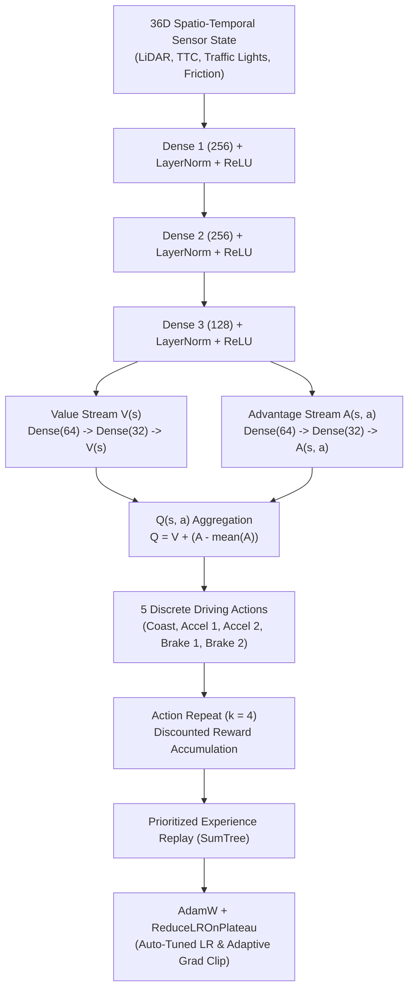

<div align="center">
  <h1>🚦 Autonomous Crossroad AI Simulation</h1>
  <p>
    
    
    
    
    
    
  </p>

  
  <br><br>
  <i>An advanced, 60 FPS, realistic multi-agent 4-way intersection simulation powered by Deep Reinforcement Learning, real-time hyperparameter auto-tuning, and authentic traffic physics.</i>
</div>

<br>

> **Welcome to the Autonomous Crossroad Simulation!** This project demonstrates a highly complex, self-learning traffic ecosystem where autonomous vehicles use deep neural networks to navigate a busy multi-lane intersection. From dynamic weather physics and emergency preemption to real-time optimizer auto-tuning, everything is simulated concurrently in real-time.

<br>

## 🌟 What's New in Recent Updates

### 🧠 1. Deep 6-Stage Dueling DQN Architecture
The neural network policy has been upgraded to a deep 6-stage representation pipeline:
* **Stage 1 (Sensory Inputs):** 36-dimensional observation vector (9-ray directional LiDAR, relative closing speeds, traffic signal states, road friction, and Time-to-Collision).
* **Stage 2 & 3 & 4 (Deep Feature Extractors):** Triple-layer dense backbone (`Dense 1 (256)` $\to$ `Dense 2 (256)` $\to$ `Dense 3 (128)`) equipped with `LayerNorm` and non-linear `ReLU` activations.
* **Stage 5 (Dual Branch Deep Streams):**
  * **State-Value Stream $V(s)$:** Multi-layer projection (`128 -> 64 -> 32 -> 1`) evaluating state safety.
  * **Action-Advantage Stream $A(s, a)$:** Multi-layer projection (`128 -> 64 -> 32 -> 5`) scoring relative action value.
* **Stage 6 (Q-Out Aggregation):** $Q(s, a) = V(s) + \left( A(s, a) - \frac{1}{|A|}\sum A(s, a') \right)$.

### ⚙️ 2. Real-Time Dynamic Auto-Tuner & Adaptive Optimization
* **PyTorch AdamW Engine:** Upgraded optimizer with decoupled weight decay ($1\times 10^{-5}$) and AMSGrad for high training stability.
* **Real-Time Plateau Scheduler:** `torch.optim.lr_scheduler.ReduceLROnPlateau` continuously monitors moving average loss and TD-error variance.
* **Permissible Threshold Bounds:**
  * **Learning Rate Bounds:** Dynamically scaled and strictly bounded within $[2\times 10^{-5}, 1.5\times 10^{-3}]$.
  * **Adaptive Gradient Clipping:** Dynamically tuned between $[0.5, 3.0]$ based on live gradient volatility.
  * **Stability Guard:** Automatically tightens gradient limits when volatility spikes and safely accelerates learning rate when loss variance stabilizes ($< 0.05$).

### ⏱️ 3. Action Repeat with Mathematically Sound Reward Accumulation
* Implemented frame skipping ($k = 4$ action repeat) with true temporal discounting:
  $$R_t = \sum_{i=0}^{k-1} \gamma^i r_{t+i}$$
* Transitions are stored precisely as $(s_t, a_t, R_t, s_{t+k}, \text{done})$ in Prioritized Experience Replay (PER).

### 🚦 4. Traffic Engineering & Physical Stop Line Compliance
* **Standardized Stop Line Hierarchy:** Stop lines are drawn **upstream** ($36\text{px}$ before the intersection box), followed by an $8\text{px}$ safety buffer, a $22\text{px}$ zebra crosswalk, and the conflict zone.
* **Centered Pedestrian Crossings:** Pedestrians walk directly down the exact centerline ($17\text{px}$ offset) of the crosswalk stripes.
* **Physical Stop-Line Enforcement:** Vehicles approaching Red or Yellow signals decelerate smoothly and hard-stop $4\text{px}$ before the stop line, completely eliminating crosswalk creep.
* **Signal Clearance Fix:** Eliminated yellow light oscillation loops by adding an 8-second emergency cooldown and enforcing minimum phase intervals.

### 🚗 5. Universal Collision Avoidance & Heavy Vehicle Overhaul
* **Multi-Route Corridor Detection:** Vehicles scan along their forward heading regardless of `route_id`, enabling cars going straight and turning right in the same physical approach lane to detect each other.
* **True Bumper-to-Bumper Clearance:** Clearance accounts for varying vehicle dimensions (Trucks: $58\text{px}$, Buses: $64\text{px}$, Motorcycles: $24\text{px}$), maintaining a guaranteed $\ge 10\text{px}$ cushion at standstills.
* **Anti-Overlap Repulsion:** Elastic positional separation pushes bounding boxes apart during SAT collisions, preventing vehicle merging.
* **Spatial Spawn Clearance:** Spawn points check euclidean distance ($115\text{px}$) to prevent spawning on top of queued traffic.

### ⚡ 6. High-Performance Optimization (Solid 60 FPS)
* **Spatial Distance Culling in Sensors:** Discards 95% of distant vehicles prior to segment generation, reducing ray-segment intersection checks from ~38,000 to ~1,200 per frame.
* **Font Caching:** Eliminated disk `SysFont` queries from per-frame draw loops.
* **Thread-Safe Training Worker:** Decoupled PyTorch training onto a background thread with controlled GIL sleep (`8ms`) and thread limiting (`torch.set_num_threads(2)`), keeping the Pygame render loop locked at 60 FPS.

### 🖥️ 7. Windows 11 Fluent UI & Live Operation Badges
* **Live Vehicle Operation Badges:** Each vehicle renders an acrylic badge displaying its ID and real-time operation:
  `#ID • DRIVE ▶`, `#ID • STOP ⏸`, `#ID • BRAKE 🛑`, `#ID • RIGHT ↱`, `#ID • LEFT ↰`, `#ID • EMERGENCY 🚨`, `#ID • CRASH 💥`.
* **6-Stage Neural Visualizer:** Real-time synaptic diagram showing live neuron firing across all 6 deep layers in the sidebar.
* **Auto-Resolution Detection:** Automatically fits any desktop monitor resolution without blurry scaling.
* **Solid Opaque UI:** Premium Fluent dark theme with zero bleed-through.
* **Comprehensive Telemetry:** Displays FPS, active cars, passed/crash count, training step iteration, episode count, and formatted elapsed training timer.
* **Project Credits Footer:** Dedicated footer card honoring creators.

<br>

## 🧠 Core Mechanisms & Architecture



<br>

## 🎮 Controls & Keybindings

| Key | Action |
| :--- | :--- |
| <kbd>Space</kbd> | Pause / Resume Simulation |
| <kbd>1</kbd> | **Untrained Mode** (Exploration & baseline) |
| <kbd>2</kbd> | **Live Training Mode** (Real-time learning with Auto-Tuner) |
| <kbd>3</kbd> | **Master AI Mode** (Trained autonomous driving policy) |
| <kbd>W</kbd> | Toggle Weather (☀️ Clear / 🌧️ Rain / ⛈️ Storm) |
| <kbd>N</kbd> | Toggle Day / Sunset / Night Lighting Engine |
| <kbd>A</kbd> | Spawn Emergency Ambulance (Priority preemption) |
| <kbd>S</kbd> | Spawn Random Vehicle |
| <kbd>T</kbd> | Manually Switch Traffic Light Phase |
| <kbd>V</kbd> | Toggle 9-Ray LiDAR Vision Display |
| <kbd>R</kbd> | Reset Statistics & Performance Counters |
| <kbd>F11</kbd> | Fullscreen Toggle |
| `Mouse Click` | Click on any car to inspect its 6-stage Neural Network |

<br>

## 🚀 How to Run

### Option A: 1-Click Fast Method (Windows)
Simply double-click the **`run.bat`** file to launch the graphical simulation instantly!

### Option B: Manual Execution
1. Activate your virtual environment:
   ```powershell
   .\venv\Scripts\activate
   ```
2. Install dependencies:
   ```powershell
   pip install -r requirements.txt
   ```
3. Run the main simulation:
   ```powershell
   python src\main.py
   ```

### Option C: Fast Headless Training
To train the deep model rapidly without rendering graphics:
```powershell
python src\train_headless.py
```

<br>

## 📁 Project Structure

```text
📦 Cross Road
┣ 📂 assets/                 # Screenshots and visual documentation
┣ 📂 src/
┃ ┣ 📂 ai/                   # Deep Neural Networks & RL Agent
┃ ┃ ┣ 📜 network.py          # 6-Stage Deep Dueling DQN architecture
┃ ┃ ┗ 📜 dqn_agent.py        # PER SumTree buffer, AdamW, ReduceLROnPlateau auto-tuner
┃ ┣ 📂 render/               # Rendering & UI
┃ ┃ ┣ 📜 lighting.py         # Dynamic day/night conical headlights & ambient lightmaps
┃ ┃ ┣ 📜 renderer.py         # Intersection markings, zebra crossings, stop lines
┃ ┃ ┗ 📜 ui_hud.py           # Solid Fluent HUD, live badges, 6-stage neural visualizer
┃ ┣ 📂 simulation/           # Physics, Kinematics & Traffic System
┃ ┃ ┣ 📜 vehicle.py          # SAT OBB collisions, headway, live operation badges
┃ ┃ ┣ 📜 pedestrians.py      # Centerline crosswalk routes and pedestrian behaviors
┃ ┃ ┣ 📜 sensors.py          # 9-ray LiDAR raycasting with spatial distance culling
┃ ┃ ┣ 📜 traffic_controller.py # Adaptive queue signals & non-oscillating preemption
┃ ┃ ┣ 📜 weather.py          # Dynamic rain, puddles, and friction coefficient
┃ ┃ ┗ 📜 intersection.py     # Dynamic multi-resolution road geometry & bezier paths
┃ ┣ 📜 config.py             # Hyperparameters, physical profiles, and timings
┃ ┃ ┗ 📜 train_headless.py   # High-speed PyTorch headless training script
┃ ┗ 📜 main.py               # Main application loop, worker threading, resolution detection
┣ 📂 tests/                  # Automated verification test suites
┣ 📜 README.md               # Project documentation
┣ 📜 requirements.txt        # Python dependencies
┣ 📜 run.bat                 # 1-Click GUI runner
┗ 📜 train.bat               # 1-Click Headless Training runner
```

<br>

## 👥 Project Creators & Developers

This project is created and actively developed by:
* **Mohammadreza Mirtaleb** ([@mohammadrezamirtaleb](https://github.com/mohammadrezamirtaleb))
* **Mahdi Ajami** ([@mahdiajami](https://github.com/mahdiajami))

---
<div align="center">
  <i>Built with ❤️ for Autonomous Driving & Deep Reinforcement Learning Research.</i>
</div>
