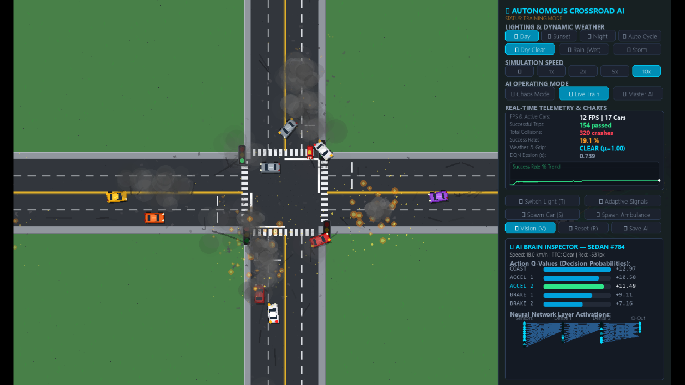

<div align="center">
  
  
  <h1>🚦 Cross Road: Autonomous AI Simulation</h1>
  <p><b>Advanced Deep Reinforcement Learning for Autonomous Traffic Management & Navigation</b></p>
  
  [](https://www.python.org/)
  [](https://pytorch.org/)
  [](https://www.pygame.org/)
</div>

---

## 🌟 درباره پروژه (About the Project)

این پروژه یک شبیه‌ساز پیشرفته **یادگیری تقویتی عمیق (Deep RL)** است که رفتار ترافیکی تقاطع‌ها و خودروهای خودران را با استفاده از الگوریتم **Dueling Double DQN** به تصویر می‌کشد.

در این محیط، خودروها با استفاده از هوش مصنوعی یاد می‌گیرند که چگونه بدون تصادف، با سرعت و امنیت کامل از یک چهارراه شلوغ عبور کنند. آنها شرایط جوی (آب‌وهوا)، چراغ‌های راهنمایی، عابران پیاده و سایر خودروها را با سنسورهای رادار و لیزر خود (LiDAR-like) درک می‌کنند و تصمیم‌گیری می‌کنند.

---

## 🚀 ویژگی‌های کلیدی و خفن پروژه

- 🧠 **هوش مصنوعی پیشرفته (Deep RL):** استفاده از `Prioritized Experience Replay (PER)` و معماری `Dueling DQN` برای یادگیری سریع‌تر.
- 🌦️ **آب و هوای داینامیک:** بارش باران، برف و تغییر میزان لغزندگی (Grip/Friction) جاده که شبکه عصبی آن را درک کرده و رفتارش را تطبیق می‌دهد.
- 🚶 **عابران پیاده و خط عابر:** مدل یاد می‌گیرد در برخورد با عابران روی خط عابر پیاده توقف کند.
- 🚑 **سیستم اورژانس هوشمند:** خودروهای آمبولانس می‌توانند چراغ‌ها را به صورت اضطراری تغییر دهند (Emergency Preemption).
- 🌙 **سیستم نورپردازی شب و روز:** رندرینگ پیشرفته سایه‌ها و نور چراغ خودروها در شب.
- 📊 **داشبورد سایبرپانک و لایو:** نمایش زنده آمار شبکه عصبی، Q-Values و فعال‌سازی نورون‌های هوش مصنوعی درون UI.

---

## 📁 ساختار پوشه‌ها و معماری کد

```text
📁 Cross Road/
├── 📄 run.bat                     # اجرای سریع شبیه‌ساز گرافیکی
├── 📄 train.bat                   # اجرای آموزش شبکه بدون گرافیک (سریع)
├── 📄 requirements.txt            # پیش‌نیازهای پایتون
├── 📄 README.md                   # همین فایلی که می‌خوانید!
├── 📁 assets/                     # تصاویر و بنرها
│   └── 🖼️ banner.png
├── 📁 src/                        # سورس‌کد اصلی پروژه
│   ├── 📄 config.py               # تنظیمات کلی و هایپرپارامترهای RL
│   ├── 📄 main.py                 # هسته اصلی و حلقه گرافیکی بازی/شبیه‌ساز
│   ├── 📄 train_headless.py       # اسکریپت آموزش سریع در پس‌زمینه (بدون UI)
│   ├── 📁 ai/                     # ماژول‌های هوش مصنوعی
│   │   ├── 📄 dqn_agent.py        # عامل DQN، بافر و منطق یادگیری تقویتی
│   │   ├── 📄 network.py          # معماری شبکه عصبی (PyTorch)
│   │   └── 📁 weights/            # محل ذخیره مغز آموزش دیده (مدل pt)
│   ├── 📁 simulation/             # فیزیک و منطق جهان شبیه‌سازی
│   │   ├── 📄 vehicle.py          # فیزیک خودروها و برخورد
│   │   ├── 📄 sensors.py          # سنسورها، رادار و محاسبه TTC
│   │   ├── 📄 intersection.py     # مسیرها و هندسه تقاطع
│   │   ├── 📄 pedestrians.py      # هوش و حرکت عابران پیاده
│   │   ├── 📄 weather.py          # موتور آب و هوا و اصطکاک جاده
│   │   ├── 📄 traffic_controller.py # کنترلر چراغ‌های راهنمایی هوشمند
│   │   └── 📄 particles.py        # ذرات دود، جرقه و خط ترمز
│   └── 📁 render/                 # موتور رندرینگ و گرافیک
│       ├── 📄 renderer.py         # کشیدن محیط و خودروها
│       ├── 📄 lighting.py         # سیستم سایه و نور در شب
│       └── 📄 ui_hud.py           # رابط کاربری خفن و داشبورد زنده هوش مصنوعی
└── 📁 tests/                      # تست‌های واحد
    └── 📄 test_collision.py       # تست سیستم تشخیص تصادف
```

---

## 🎮 نحوه نصب و اجرا

### ۱. نصب پیش‌نیازها
ابتدا پایتون ۳ (ترجیحاً ۳.۱۰ به بالا) را نصب کرده و سپس پکیج‌های زیر را نصب کنید:
```bash
pip install -r requirements.txt
```

### ۲. اجرای شبیه‌ساز (گرافیکی)
برای تماشای محیط و رانندگی هوش مصنوعی، فایل `run.bat` را اجرا کنید یا دستور زیر را در ترمینال بزنید:
```bash
python src/main.py
```

### ۳. آموزش هوش مصنوعی (بدون گرافیک)
برای اینکه هوش مصنوعی در بک‌گراند بدون اتلاف منابع برای گرافیک آموزش ببیند، `train.bat` را اجرا کنید:
```bash
python src/train_headless.py
```

---

## ⌨️ کلیدهای میانبر (در محیط گرافیکی)

- `Space`: توقف / ادامه شبیه‌ساز
- `W`: تغییر آب و هوا (آفتابی -> بارانی -> طوفانی)
- `N`: تغییر روز و شب
- `T`: تغییر دستی چراغ راهنمایی
- `A`: اسپاون آمبولانس
- `V`: نمایش/مخفی کردن اشعه‌های لیزر سنسور هوش مصنوعی (Vision Rays)
- `1` / `2` / `3`: تغییر حالت هوش مصنوعی بین: احمق (آشوب) / در حال یادگیری / استاد (Master)

<br>
<div align="center">
  <i>Made with ❤️ for AI Enthusiasts</i>
</div>
