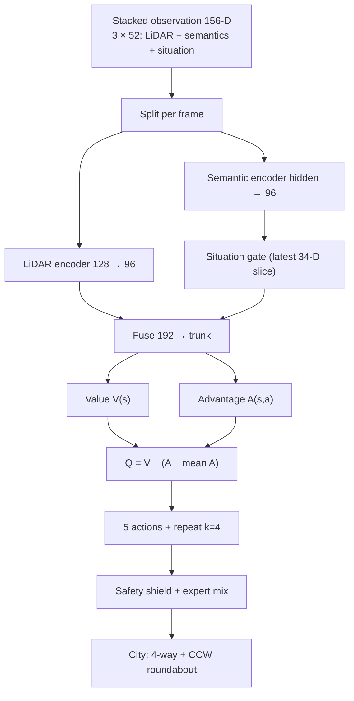

<div align="center">
  <h1>CROSS ROAD OPS</h1>
  <p>
    
    
    
    
    
    
  </p>

  
  <br><br>
  <i>A dual-node city: signalized 4-way in the north, yield roundabout in the south. Cars follow arc-length routes and a situation-gated Dueling DQN that shares speed control with an expert policy and a hard safety shield.</i>
</div>

<br>

This repository is a multi-agent traffic simulator. Vehicles do not steer freely: each car is spawned on a lane-specific polyline (approach, ring, exit). The policy chooses one of five longitudinal actions. Geometry, give-way, and the shield are what keep the roundabout one-way and usable; the network learns when to go, yield, and brake.

<br>

## City network

Two east–west arterials share a 3+3 north–south corridor.

```
        [North spawn]
              |
     3+3 lane NS arterial
              |
     +--------+--------+   Main Avenue — signalized 4-way
     |   lights / zebra |
     +--------+--------+
              |
        connector NS
              |
     +----(  two-lane  )----+   Boulevard — yield roundabout
     |     roundabout       |
     +----------------------+
              |
        [South spawn]
```

| Item | Value |
| :--- | :--- |
| Lanes per direction | 3 (`LANE_WIDTH` 26 px, two-way road 156 px) |
| Drive side | Right-hand traffic |
| Roundabout island / inner / outer center / curb | 30 / 48 / 74 / 102 px |
| Circulation | One-way **counter-clockwise** (N → W → S → E) for every route |
| 4-way | Pre-timed / adaptive signals, stop lines 36 px upstream, zebras |
| Roundabout | Yield on entry; only upstream circulating traffic in a 105° arc has priority |
| Emergency | Ambulance, fire, police: siren pull-over, signal preemption, keep moving in the ring |

**Roundabout path rules (why crashes dropped):**

* Join and leave on **travel lanes**, not the double-yellow centerline. Southbound stays west of center; eastbound stays south of center.
* Two circulating centerlines: **outer** (right / through) and **inner** (left-turn lane).
* Through and turning traffic share the **same** CCW direction. Mixed CW/CCW through-cuts caused head-on entries.
* `THROUGH` connectors (including W→S and E→S from the 4-way) continue into the circle and exit south; they no longer dead-end at the north mouth.
* Boulevard OD pairs (W↔E, turns, S→N) exist on **all three lanes**.
* Each route stores `entry_alpha` and `circ_ccw` so the yield rule matches that car’s join angle.

Architecture notes: `docs/city-simulation/`, `docs/traffic-simulation/`, `docs/emergency-simulation/`.

<br>

## Observation and policy

### State (52 per frame × 3 = 156)

| Block | Size | Content |
| :--- | ---: | :--- |
| LiDAR | 18 | 9 rays: range + relative speed |
| Signal | 5 | RED / YELLOW / GREEN / YIELD / none |
| Kinematics | 4 | Stop distance, speed, target speed, lead distance |
| City extras | 11 | Conflict radar, friction, in-ring, density, EMS, lane, yield, yield distance, in-box, inverted TTC |
| Situation slice | 14 | Context (signal / ring / entry / exit / follow), EMS, stalled or crossing lead, path clear, legal go, self stalled, progress, queue restart, exit intent |

Old checkpoints with a smaller `state_dim` **fail closed**. The console prints that weights do not match and live training starts from scratch. That is expected after sensor or network changes.

### Situation-gated Dueling DQN

Two encoders, then a fuse and dueling heads:

1. **LiDAR stream** — reactive safety from stacked rays.
2. **Semantic stream** — lights, yield, leader, situation slice.
3. **Gate** — sigmoid from the *latest* situation frame scales the semantic embedding (a red stop and a car frozen in a clear ring are not the same “low speed”).
4. **Fuse → value / advantage → Q-out** — five actions: coast, mild accel, full accel, mild brake, hard brake.

HUD inspector layers: Sensors / LiDAR / Situation / Fuse / Val-Adv / Q-Out.

### Who actually drives

| Mode (keys 1 / 2 / 3) | Behavior |
| :--- | :--- |
| Untrained | **100% expert** (not random). Random policy plus the shield used to freeze the whole city. |
| Training | Mix of expert and ε-greedy DQN, plus the safety shield |
| Master | Loaded weights if `state_dim` matches; otherwise training |

Shared with the live sim and `train_headless.py`:

* **Expert** — yield to real priority traffic, stop for red/yellow, follow gaps, accelerate in a clear ring.
* **Safety shield** — blocks accel into a short TTC or gap; standing car with a legal gap gets a go override (`ACCEL`) so COAST at speed 0 cannot deadlock.
* **Ring physics** — after clearing yield, do not park in the circle; civilians pull aside for EMS and keep rolling; LiDAR TTC across the island is ignored on the ring (corridor scan only).
* **Wreck linger** — shorter cleanup inside the roundabout so one crash does not block the ring.

Action repeat `k = 4` with discounted return \(R_t = \sum_{i=0}^{k-1} \gamma^i r_{t+i}\) into prioritized replay. Optimizer: AdamW, `ReduceLROnPlateau`, adaptive grad clip.

<br>

## Rendering and UI

* 2.5D cityscape: extruded curbs, buildings, trees, plaza (`src/render/cityscape.py`).
* Roundabout plaza: island, dashed splitter between inner/outer rings, chevrons in the CCW direction.
* Ops HUD: slate + copper `#E8A54B` + mint. Title **CROSS ROAD OPS**.
* Vehicle badges are text only: `DRIVE` / `STOP` / `BRAKE` / `EMS` / `CRASH`.
* Cached day/night backgrounds. **Restart the sim** after geometry changes so the cache rebuilds.

<br>

## Controls

| Key | Action |
| :--- | :--- |
| <kbd>Space</kbd> | Pause / resume |
| <kbd>1</kbd> | Untrained (expert baseline) |
| <kbd>2</kbd> | Live training |
| <kbd>3</kbd> | Master (if weights load) |
| <kbd>W</kbd> | Weather (clear / rain / storm) |
| <kbd>N</kbd> | Day / sunset / night |
| <kbd>A</kbd> / <kbd>F</kbd> / <kbd>P</kbd> | Ambulance / fire / police |
| <kbd>S</kbd> | Spawn a random vehicle |
| <kbd>T</kbd> | Next traffic-light phase |
| <kbd>V</kbd> | Draw LiDAR rays |
| <kbd>R</kbd> | Reset stats |
| <kbd>F11</kbd> | Fullscreen |
| Mouse click | Inspect the selected car’s network |

<br>

## How to run

On this machine use **`py -3.12`**. The Anaconda `python` on PATH may not have Pygame.

### GUI

```powershell
py -3.12 -m pip install -r requirements.txt
py -3.12 src\main.py
```

Or double-click `run.bat` if it points at the same interpreter.

### Headless training

```powershell
py -3.12 src\train_headless.py
```

Weights write to `src/ai/weights/pretrained_master.pt`. After an observation or architecture change, delete or ignore that file; a mismatch is not a crash.

### Tests

Run files as scripts (not `python -m unittest` if the env is wrong):

```powershell
py -3.12 tests\test_city_network.py
py -3.12 tests\test_situation_policy.py
py -3.12 tests\test_collision.py
py -3.12 tests\test_reward.py
```

City tests cover dual nodes, W→S / E→S through the ring, EMS vs stopped civilians, two circulating radii, north joins off the yellow, three boulevard lanes, **one-way CCW**, and outbound travel lanes.

<br>

## Network diagram



<br>

## Project layout

```text
Cross Road
├── assets/
├── docs/
│   ├── city-simulation/
│   ├── traffic-simulation/
│   └── emergency-simulation/
├── src/
│   ├── ai/
│   │   ├── network.py          # situation-gated dueling DQN
│   │   ├── dqn_agent.py        # PER, AdamW, fail-closed weight load
│   │   └── weights/            # pretrained_master.pt (optional)
│   ├── render/
│   │   ├── cityscape.py        # 2.5D parks, plaza, CCW chevrons
│   │   ├── renderer.py         # roads, 3-lane dashes, cached backgrounds
│   │   ├── lighting.py
│   │   └── ui_hud.py           # CROSS ROAD OPS console
│   ├── simulation/
│   │   ├── intersection.py     # lanes, CCW arcs, THROUGH + ROUNDABOUT routes
│   │   ├── vehicle.py          # physics, yield lock, EMS, ring min-flow
│   │   ├── sensors.py          # LiDAR + 14-D situation
│   │   ├── traffic_controller.py
│   │   ├── pedestrians.py
│   │   ├── weather.py
│   │   └── particles.py
│   ├── config.py
│   ├── main.py
│   └── train_headless.py       # expert, shield, shared signal_for()
├── tests/
├── requirements.txt
├── run.bat
└── README.md
```

<br>

## Project creators

* **Mohammadreza Mirtaleb** ([@mohammadrezamirtaleb](https://github.com/mohammadrezamirtaleb))
* **Mahdi Ajami** ([@mahdiajami](https://github.com/mahdiajami))

---
<div align="center">
  <i>Geometry first, then yield, then RL.</i>
</div>
