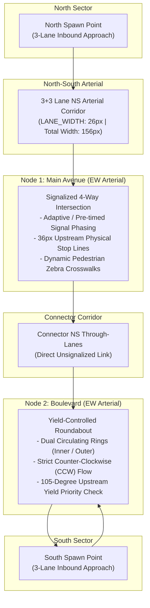
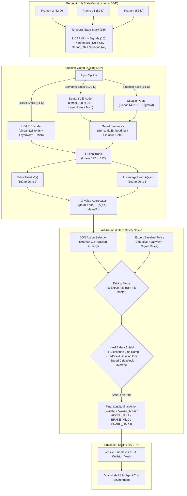
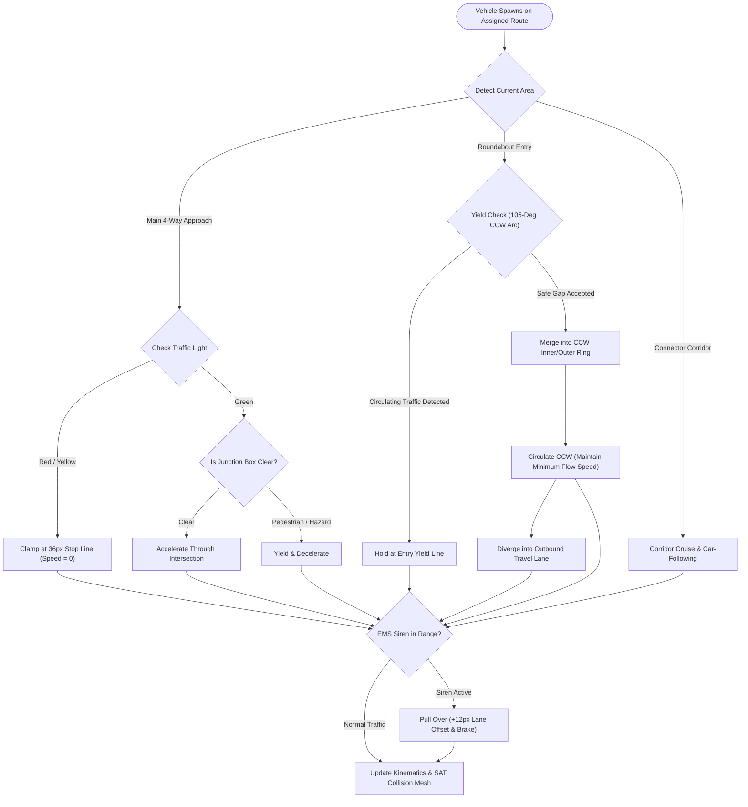

<div align="center">
  <h1>🚦 CROSS ROAD OPS</h1>
  <p>
    
    
    
    
    
    
    
  </p>

  
  <br><br>
  <i>A high-fidelity dual-node urban traffic simulator featuring a signalized 4-way intersection in the north and a yield-controlled roundabout in the south. Autonomous agents navigate arc-length trajectory routes using a Situation-Gated Dueling DQN integrated with a hard safety shield and emergency vehicle preemption.</i>
</div>

<br>

---

## 📑 Table of Contents

- [Overview](#-overview)
- [City Network Architecture](#-city-network-architecture)
- [System Architecture & Flowcharts](#-system-architecture--flowcharts)
  - [1. Perception & Decision Pipeline](#1-perception--decision-pipeline)
  - [2. Multi-Agent Traffic Execution Flow](#2-multi-agent-traffic-execution-flow)
- [Deep Reinforcement Learning](#-deep-reinforcement-learning)
  - [Observation Space (156-D)](#observation-space-156-d)
  - [Action Space](#action-space)
  - [Situation-Gated Dueling DQN Architecture](#situation-gated-dueling-dqn-architecture)
  - [Safety Shield & Arbitration Policy](#safety-shield--arbitration-policy)
  - [Reward Shaping](#reward-shaping)
- [Emergency & Urban Simulation](#-emergency--urban-simulation)
- [Visualization & Neural HUD](#-visualization--neural-hud)
- [Interactive Controls](#-interactive-controls)
- [Installation & Quick Start](#-installation--quick-start)
- [Automated Testing](#-automated-testing)
- [Project Layout](#-project-layout)
- [Project Creators](#-project-creators)

---

## 🌟 Overview

**Cross Road Ops** is an autonomous multi-agent traffic simulation platform engineered in Python, PyTorch, and Pygame. Rather than relying on unconstrained 2D steering, vehicles travel along lane-specific cubic spline and arc-length polylines spanning approaches, circulating rings, and exits. 

Longitudinal dynamics are governed by a **Situation-Gated Dueling Deep Q-Network (DQN)** coupled with an analytical expert fallback and a collision-prevention safety shield. The simulation models complex urban challenges including unsignalized give-way yields, traffic light phase transitions, pedestrian crosswalk interactions, dynamic weather friction, and emergency vehicle sirens with active green-wave preemption.

<br>

---

## 🏙️ City Network Architecture

The city map models a dual-node urban corridor combining two East-West arterials connected via a shared 3+3 North-South corridor.



### Key Specifications

| Parameter | Specification | Description |
| :--- | :--- | :--- |
| **Lanes per Direction** | `3` (`NUM_LANES_PER_DIR`) | Left-turn, through, right-turn lanes (`LANE_WIDTH = 26 px`, total road `156 px`) |
| **Traffic Rules** | Right-Hand Traffic (RHT) | Southbound uses $x < c_x$, Northbound uses $x > c_x$ |
| **Roundabout Radii** | `30 / 48 / 74 / 102 px` | Central island, inner ring center, outer ring center, curb limit |
| **Circulation** | Counter-Clockwise (CCW) | Strictly enforced CCW flow ($N \rightarrow W \rightarrow S \rightarrow E$) |
| **Signalized 4-Way** | Adaptive Phase Ring | `NS_GREEN` $\rightarrow$ `NS_YELLOW` $\rightarrow$ `ALL_RED` $\rightarrow$ `EW_GREEN` $\rightarrow$ `EW_YELLOW` $\rightarrow$ `ALL_RED` |
| **Give-Way Yield Rule** | Dynamic 105° Arc Check | Entering vehicles yield strictly to upstream circulating traffic within priority zone |
| **Priority Units** | EMS Preemption | Ambulance, Fire Truck, Police with siren broadcast and automatic civilian pull-over |

<br>

---

## 📊 System Architecture & Flowcharts

### 1. Perception & Decision Pipeline

The diagram below illustrates the end-to-end multi-frame perception processing, Situation-Gated neural trunk, value/advantage decomposition, and safety shield mediation:



<br>

### 2. Multi-Agent Traffic Execution Flow



<br>

---

## 🧠 Deep Reinforcement Learning

### Observation Space (156-D)

The agent receives a 3-frame stacked observation vector ($3 \times 52 = 156$ dimensions) capturing dense spatial, kinematic, and semantic environmental context:

| Component | Dims / Frame | Total Dims | Description |
| :--- | :---: | :---: | :--- |
| **LiDAR Rays** | 18 | 54 | 9 forward-facing rays ($\pm 60^\circ$ FOV): range $[0, 1]$ and relative closing velocity |
| **Signal State** | 5 | 15 | One-hot traffic signal encoding (`RED`, `YELLOW`, `GREEN`, `YIELD`, `NONE`) |
| **Ego Kinematics** | 4 | 12 | Distance to stop line, current speed, target cruising speed, lead vehicle gap |
| **City Radar** | 11 | 33 | Conflict radar, road friction coefficient, in-ring flag, ring traffic density, EMS siren proximity, lane index, yield flag, yield line distance, junction occupancy, inverted TTC, lateral lane offset |
| **Situation Slice** | 14 | 42 | Context mode (signal / ring / entry / exit / car-following), EMS alert, stalled/crossing lead, path clear flag, legal go indicator, self-stalled flag, progress rate, queue restart flag, exit intent |
| **Total** | **52** | **156** | **3-step temporal stack ($t, t-1, t-2$)** |

<br>

### Action Space

The network outputs $Q$-values across 5 discrete longitudinal control actions executed with an action-repeat factor of $k = 4$:

| Action ID | Name | Acceleration / Deceleration | Functional Role |
| :---: | :--- | :---: | :--- |
| `0` | **COAST** | $0.0 \text{ m/s}^2$ | Maintain velocity, zero throttle / brake resistance |
| `1` | **ACCEL_MILD** | $+1.2 \text{ m/s}^2$ | Smooth cruising adjustment, low-speed gap following |
| `2` | **ACCEL_FULL** | $+2.8 \text{ m/s}^2$ | Merging into roundabout gaps, clearing green lights |
| `3` | **BRAKE_MILD** | $-1.8 \text{ m/s}^2$ | Approaching stop lines, gradual deceleration |
| `4` | **BRAKE_HARD** | $-4.5 \text{ m/s}^2$ | Emergency stopping, pedestrian yield, collision avoidance |

<br>

### Situation-Gated Dueling DQN Architecture

* **Dual-Stream Encoder**: Dedicated feedforward sub-networks process the LiDAR depth array and the semantic features independently.
* **Situation-Conditioned Gating**: The latest 14-dimensional situation vector passes through a gating layer with Sigmoid activation to dynamically scale the semantic representation. This prevents misinterpretations (e.g., distinguishing a legal red light stop from a deadlock in a clear roundabout).
* **Dueling Value & Advantage Streams**: Computes state value $V(s)$ and action advantage $A(s, a)$, recombining via:
  $$Q(s, a) = V(s) + \left( A(s, a) - \frac{1}{|\mathcal{A}|} \sum_{a'} A(s, a') \right)$$
* **Prioritized Experience Replay (PER)**: Proportional priority sampling with importance-sampling weights ($\beta$).
* **Optimization**: AdamW optimizer with cosine learning rate scheduling and `ReduceLROnPlateau`.

<br>

### Safety Shield & Arbitration Policy

The simulator implements a three-tier hierarchical controller:

1. **Untrained Mode (`Key 1`)**: Driven by a 100% rule-based expert baseline ensuring realistic traffic flow from initialization.
2. **Training Mode (`Key 2`)**: Blends $\varepsilon$-greedy DQN exploration with expert intervention and active shield monitoring.
3. **Master Mode (`Key 3`)**: Pure neural policy inference with active safety shield verification.

> [!IMPORTANT]
> **Safety Shield Guarantees:**
> - **TTC Clamp**: Intercepts acceleration actions if Time-To-Collision (TTC) falls below safety margins ($< 1.0\text{s}$).
> - **Deadlock Prevention**: Overrides zero-speed `COAST` commands with `ACCEL` when the downstream path is legally clear, preventing frozen vehicles at green lights.
> - **Roundabout Anti-Lock**: Prevents parking in circulating rings once entry yield is resolved.

<br>

### Reward Shaping

The reward function $R_t$ balances throughput, safety, and legal compliance:

$$R_t = r_{\text{progress}} + r_{\text{headway}} + r_{\text{signal}} + r_{\text{yield}} + r_{\text{ems}} - p_{\text{collision}} - p_{\text{stall}}$$

- **Progress & Efficiency**: Continuous reward for forward progress along the spline proportional to speed target matching.
- **Headway & Safe Distance**: Positive reward for maintaining 2-second spacing; penalties for tailgating.
- **Signal & Stop Compliance**: High bonus for smooth stops at red/yellow lights; heavy penalties for crossing stop lines illegally.
- **EMS Courtesy**: Bonus for pulling over and granting right-of-way to active sirens; penalty for obstructing emergency paths.
- **Collision Penalty**: Large terminal penalty on contact, attributing fault to moving vehicles hitting stationary queues.

<br>

---

## 🚑 Emergency & Urban Simulation

### Emergency Fleet Hierarchy

| Unit Type | Length | Max Speed | Lighting / Siren Signature | Operational Role |
| :--- | :---: | :---: | :--- | :--- |
| **Ambulance** | $44\text{ px}$ | $5.5\text{ px/frame}$ | White body, red cross, dual red/blue lightbar | Rapid medical transit |
| **Fire Truck** | $62\text{ px}$ | $5.2\text{ px/frame}$ | Heavy red chassis, amber roof deck, strobe | Heavy rescue response |
| **Police Cruiser** | $40\text{ px}$ | $6.0\text{ px/frame}$ | Midnight navy, high-frequency alternating flashers | Fast tactical intercept |

- **Signal Preemption**: Approaching EMS units detect opposing green phases and trigger an immediate safe yellow $\rightarrow$ all-red $\rightarrow$ emergency green cycle with an 8-second cooldown.
- **Civilian Lateral Evasion**: Surrounding civilian vehicles detect siren acoustics ($< \text{SIREN\_RADIUS}$) and shift laterally by $+12\text{ px}$ toward the road shoulder while reducing speed.

<br>

### Environmental Dynamics

- **Dynamic Crosswalks**: Pedestrians spawn on designated zebra crossings, respecting pedestrian signal timers and triggering vehicle safety shields using Separating Axis Theorem (SAT) collision meshes.
- **Weather Physics**: Dynamic switching between `CLEAR`, `RAIN`, and `STORM` conditions, dynamically reducing road friction ($\mu \in [0.45, 1.0]$) and lengthening braking distances.
- **Lighting Cycles**: Seamless day, sunset, and night transitions with ambient darkness overlays and vehicle headlight illumination beams.

<br>

---

## 🖥️ Visualization & Neural HUD

The simulation features a 2.5D urban renderer (`src/render/cityscape.py`) and a real-time neural HUD inspector:

* **2.5D City Elements**: Extruded curbs, road asphalt textures, roundabout splitter islands, directional chevrons, trees, and buildings.
* **Neural Inspector Layers**:
  - `Sensors`: Real-time 9-ray LiDAR depth and closing velocity visualization.
  - `Situation`: Contextual situational flags and hazard radar.
  - `Fusion & Val/Adv`: Intermediate latent feature activations and $V(s)$ baseline.
  - `Q-Values`: Real-time bar chart of Q-values across all 5 actions.
* **Telemetry**: Real-time FPS, active vehicle count, collision metrics, average velocity, and training episode returns.

<br>

---

## 🎮 Interactive Controls

| Key | Function | Description |
| :---: | :--- | :--- |
| <kbd>Space</kbd> | **Pause / Resume** | Toggle simulation physics and animation freeze |
| <kbd>1</kbd> | **Untrained Mode** | Run 100% rule-based expert baseline policy |
| <kbd>2</kbd> | **Training Mode** | Run active $\varepsilon$-greedy DQN training loop with experience collection |
| <kbd>3</kbd> | **Master Mode** | Run inference using loaded pretrained neural weights |
| <kbd>W</kbd> | **Weather Toggle** | Cycle through Clear $\rightarrow$ Rain $\rightarrow$ Storm |
| <kbd>N</kbd> | **Day / Night Cycle** | Cycle through Day $\rightarrow$ Sunset $\rightarrow$ Night lighting |
| <kbd>A</kbd> | **Spawn Ambulance** | Dispatch an emergency ambulance unit |
| <kbd>F</kbd> | **Spawn Fire Truck** | Dispatch an emergency fire rescue truck |
| <kbd>P</kbd> | **Spawn Police** | Dispatch an emergency police interceptor |
| <kbd>S</kbd> | **Spawn Random Car** | Spawn a civilian vehicle on a random entrance lane |
| <kbd>T</kbd> | **Cycle Signal Phase** | Manually advance the 4-way traffic light phase |
| <kbd>V</kbd> | **Toggle LiDAR Rays** | Show / hide real-time sensory raycasts |
| <kbd>R</kbd> | **Reset Statistics** | Clear telemetry counters, crash tallies, and average speeds |
| <kbd>F11</kbd> | **Fullscreen** | Toggle borderless fullscreen display |
| <kbd>Left Click</kbd> | **Select Vehicle** | Click any vehicle to inspect its live neural network activations in the HUD |

<br>

---

## 🚀 Installation & Quick Start

### Prerequisites

- **Python 3.12+**
- **Git**

### 1. Clone & Install Dependencies

```bash
git clone https://github.com/mohammadrezamirtaleb/AI-Powered-Projects.git
cd "AI-Powered-Projects/Reinforcement Learning/Cross Road"
pip install -r requirements.txt
```

### 2. Launch Interactive Simulation (GUI)

```bash
python src/main.py
```
*(Windows users can also double-click `run.bat`)*

### 3. Headless RL Training

To train the Situation-Gated Dueling DQN model in high-speed headless mode (without rendering overhead):

```bash
python src/train_headless.py
```
*(Model weights are automatically saved to `src/ai/weights/pretrained_master.pt`)*

<br>

---

## 🧪 Automated Testing

The repository contains comprehensive unit tests verifying network geometry, collision mechanics, reward formulation, and DQN policy behavior:

```bash
pytest tests/
```

### Test Coverage Highlights

- `tests/test_city_network.py`: Verifies dual-node geometry, roundabout CCW circulation arcs, 3+3 corridor continuity, and outbound travel lanes.
- `tests/test_reward.py`: Validates reward shaping, headway penalties, stop-line compliance, and EMS courtesy scoring.
- `tests/test_situation_policy.py`: Confirms 156-D state shape, situation gating activations, and action distribution bounds.
- `tests/test_collision.py`: Validates SAT bounding-box collision detection and fault attribution.
- `tests/test_replay_buffer.py`: Verifies Prioritized Experience Replay (PER) sampling and TD-error priority updates.

```
collected 40 items
tests/test_city_network.py ............                                  [ 30%]
tests/test_collision.py ...                                              [ 37%]
tests/test_replay_buffer.py ...                                          [ 45%]
tests/test_resize.py .                                                   [ 47%]
tests/test_reward.py ................                                    [ 87%]
tests/test_situation_policy.py .....                                     [100%]
============================= 40 passed in 6.65s ==============================
```

<br>

---

## 📁 Project Layout

```text
Cross Road
├── assets/
│   ├── banner.png                      # Project static preview image
│   └── banner_animated.gif             # Real-time simulation animated banner
├── docs/
│   ├── city-simulation/
│   │   └── ARCHITECTURE.md             # Dual-node spatial graph & lane models
│   ├── emergency-simulation/
│   │   └── ARCHITECTURE.md             # EMS fleet specs, preemption & siren logic
│   └── traffic-simulation/
│       └── ARCHITECTURE.md             # 60 Hz physics loops & observation design
├── src/
│   ├── ai/
│   │   ├── network.py                  # Situation-Gated Dueling DQN model
│   │   ├── dqn_agent.py                # PER agent, AdamW optimizer & weight manager
│   │   └── weights/                    # Neural network checkpoint files
│   ├── render/
│   │   ├── cityscape.py                # 2.5D urban structures, curbs & foliage
│   │   ├── renderer.py                 # Road asphalt, markings & cached backgrounds
│   │   ├── lighting.py                 # Day/sunset/night ambient & headlight shaders
│   │   └── ui_hud.py                   # Real-time neural activation inspector & telemetry
│   ├── simulation/
│   │   ├── intersection.py             # Dual-node geometry, CCW arcs & route manager
│   │   ├── vehicle.py                  # Multi-agent kinematics, EMS & safety shield
│   │   ├── sensors.py                  # 9-ray LiDAR & 14-D situation feature extractor
│   │   ├── traffic_controller.py       # Signal phase ring & adaptive preemption
│   │   ├── pedestrians.py              # Dynamic crosswalk agents & hazard boxes
│   │   ├── weather.py                  # Weather states & surface friction physics
│   │   └── particles.py                # Exhaust smoke, tire smoke & rain effects
│   ├── config.py                       # Global simulation & hyperparameters
│   ├── main.py                         # Pygame GUI entry point
│   └── train_headless.py               # High-speed headless RL training pipeline
├── tests/                              # Automated pytest suite (40 unit tests)
├── requirements.txt                    # Project dependencies
├── run.bat                             # One-click GUI launch script
├── train.bat                           # One-click headless training script
└── README.md                           # Documentation & architecture specifications
```

<br>

---

## 👥 Project Creators

* **Mohammadreza Mirtaleb** — [@mohammadrezamirtaleb](https://github.com/mohammadrezamirtaleb)
* **Mahdi Ajami** — [@mahdiajami](https://github.com/mahdiajami)

---

<div align="center">
  <sub>Engineered with precision for autonomous multi-agent urban mobility research.</sub>
</div>
