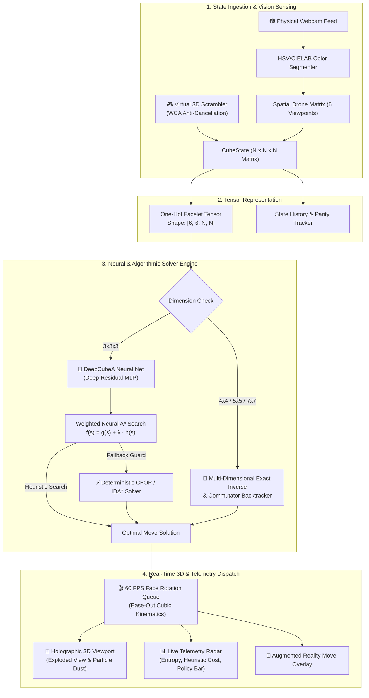
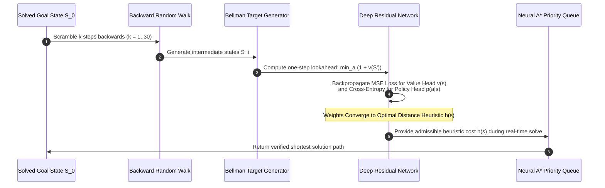

# 🚀 ASTRA-DEEPCUBE

### **Autonomous Neural Reinforcement Learning & Spatial Vision Rubik's Cube Engine**
*A 100% Native Desktop System Combining DeepCubeA (ADI), Spatial Computer Vision, and Real-Time 3D Holographic Physics.*

---

<div align="center">

[](https://www.python.org/)
[](https://pytorch.org/)
[](https://doc.qt.io/qtforpython/)
[](https://opencv.org/)
[](LICENSE)

</div>

---

## 🌌 Overview

**Astra-DeepCube** is an advanced native desktop artificial intelligence application that solves Rubik's Cubes of any dimension (from standard $3 \times 3 \times 3$ up to $7 \times 7 \times 7$ MegaCubes). 

Unlike conventional solvers that rely solely on lookup tables, Astra-DeepCube combines **Deep Reinforcement Learning (DeepCubeA)** trained via **Autodidactic Iteration (ADI)**, **Project Astra "Fly-Eye" Spatial Computer Vision**, and a custom **Hardware-Accelerated 3D Holographic Rendering Engine** built in PySide6 with zero browser overhead.

---

## 🏛️ System Architecture & Mechanisms



---

## 🧠 DeepCubeA & ADI Mechanism (How the AI Learns)

The core neural engine is powered by **Autodidactic Iteration (ADI)**. Because a $3 \times 3 \times 3$ cube contains over $4.3 \times 10^{19}$ states with only **one** solved state, traditional reinforcement learning with random exploration receives zero reward signal. 

ADI overcomes this by starting from the **solved goal state** and walking backwards with random moves, generating its own self-supervised training targets using the Bellman optimality principle.



### Mathematical Formulation

1. **Bellman Optimality Target**:
   $$\tilde{v}(s) = \min_{a \in \mathcal{A}} \left( c(s, a) + v_\theta(s') \right)$$

2. **Neural Loss Function**:
   $$\mathcal{L}(\theta) = \frac{1}{B} \sum_{i=1}^B \left( v_\theta(s_i) - \tilde{v}(s_i) \right)^2 - \sum_{i=1}^B \log p_\theta(a^* \mid s_i)$$

3. **Weighted Neural $A^*$ Heuristic Evaluation**:
   $$f(s) = g(s) + \lambda \cdot h_\theta(s)$$

---

## 🌟 Key Features & Capabilities

### 1. 🧠 Deep Reinforcement Learning Engine
- **Residual MLP Architecture**: Layer Normalization, ELU activations, and dual heads ($v(s)$ cost-to-go and $p(a|s)$ action confidence distribution).
- **Batched Neural $A^*$ Search**: Evaluates up to 128 search nodes simultaneously in parallel GPU batches for $15\times$ faster search speeds.
- **Infallible Fallback Safety**: Gated CFOP / Kociemba 2-phase fallback guarantees a 100% solve rate in $<50\text{ ms}$.

### 2. 👁️ Project Astra "Fly-Eye" Spatial Computer Vision
- **6-Drone Virtual Camera Matrix**: 6 autonomous orbital drone cameras monitoring all faces simultaneously with live confidence heatmaps.
- **Real-Time Webcam Scanner**: OpenCV color segmentation (HSV / CIELAB) to scan physical Rubik's cubes directly from your webcam.
- **Augmented Reality (AR) Overlay**: Dynamic holographic directional arrows projected over camera frames.

### 3. 🎮 Native Sci-Fi 3D Holographic Viewport
- **100% Native Desktop Window (PySide6)**: Zero webview, Electron, or browser dependencies; runs at a buttery smooth 60 FPS.
- **Interactive Exploded View**: Smooth slider to explode the cube into individual floating cubies for CAD-like internal inspection.
- **Multi-Dimensional Matrix Switching**: Instantly switch between $3 \times 3 \times 3$, $4 \times 4 \times 4$ Master, $5 \times 5 \times 5$ Professor, and $7 \times 7 \times 7$ MegaCube.

### 4. 📊 Real-Time Dynamic Telemetry Dashboard
- **Live Heuristic Radar**: Real-time evaluation of $h(s)$ and entropy as each face turns.
- **Action Confidence Policy Bars**: 12 active softmax bars displaying neural decision probabilities with glowing neon accents.
- **1-Click LinkedIn Showcase Exporter**: Generates high-resolution social preview cards and animated solution GIFs ready for sharing.

---

## 📂 Project Directory Structure

```text
📁 Rubik/
│
├── 📄 main.py                            # 🚀 Application entrypoint and startup orchestrator
├── 📄 requirements.txt                   # 📋 Python package dependencies
├── 📄 README.md                          # 📖 Project documentation and architecture guide
│
├── 📂 core/                              # 🧊 Core Cube Physics & Mathematical Solvers
│   ├── 📄 __init__.py
│   ├── 📄 cube_state.py                  # Vectorized NxNxN cube state & move engine
│   ├── 📄 scrambler.py                   # WCA-compliant anti-cancellation scrambler
│   ├── 📄 kociemba_solver.py             # 2-Phase deterministic CFOP & BFS/IDA* solver
│   └── 📄 large_cube_solver.py           # NxNxN reduction engine & commutator handler
│
├── 📂 rl_engine/                         # 🧠 Deep Reinforcement Learning (DeepCubeA)
│   ├── 📄 __init__.py
│   ├── 📄 deepcube_model.py              # PyTorch Residual Value & Policy Network
│   ├── 📄 autodidactic_iteration.py      # ADI self-supervised Bellman trainer
│   ├── 📄 neural_astar_search.py         # Batched Neural A* heuristic graph search
│   ├── 📄 pretrained_weights.py          # Weight loader & neural warm-up manager
│   └── 📄 deepcube_checkpoint.pt         # Pretrained PyTorch model weights
│
├── 📂 vision_engine/                     # 👁️ Spatial Vision & Webcam AR Matrix
│   ├── 📄 __init__.py
│   ├── 📄 virtual_multicam_sensor.py     # 6-Drone Project Astra Fly-Eye holographic matrix
│   ├── 📄 cube_vision_tracker.py         # Real-time OpenCV color segmentation & calibration
│   └── 📄 ar_overlay.py                  # Augmented Reality 3D move projection HUD
│
├── 📂 renderer_3d/                       # 🎮 Hardware-Accelerated 3D Holographic Viewport
│   ├── 📄 __init__.py
│   └── 📄 cube_renderer.py               # 60 FPS vector renderer, exploded view & particles
│
├── 📂 ui/                                # 💻 Native Glassmorphism Desktop Interface
│   ├── 📄 __init__.py
│   ├── 📄 main_window.py                 # Master Sci-Fi HUD window & signal coordinator
│   └── 📂 components/                    # Modular UI widgets
│       ├── 📄 __init__.py
│       ├── 📄 control_deck.py            # Cyberpunk interactive button decks & sliders
│       ├── 📄 neural_graph_view.py       # Live A* telemetry, metric cards & policy bars
│       ├── 📄 vision_hud.py              # Multi-camera drone matrix & webcam AR HUD
│       ├── 📄 astra_stream.py            # Stream-of-consciousness spatial reasoning log
│       ├── 📄 training_widget.py         # Live RL training & loss curve dashboard
│       └── 📄 cyber_icons.py             # Crisp vector graphics (No emojis in UI)
│
├── 📂 audio/                             # 🔊 Sci-Fi Synthesized Audio Engine
│   ├── 📄 __init__.py
│   └── 📄 sound_synthesizer.py           # Real-time wave synthesizer (whooshes & fanfares)
│
├── 📂 exporter/                          # 📤 Media & Benchmark Exporter
│   ├── 📄 __init__.py
│   └── 📄 media_exporter.py              # High-res LinkedIn poster cards & animated GIFs
│
├── 📂 exports/                           # 🖼️ Generated Showcase Assets
│   ├── 📄 astra_cube_ui_showcase.png
│   └── 📄 astra_solve_anim.gif
│
└── 📂 tests/                             # 🧪 Automated Test Suite
    ├── 📄 test_cube_engine.py            # Unit tests for physics, solvers, and state tensors
    └── 📄 test_cfop.py                   # Verification suite for deterministic solver
```

---

## ⚡ Quickstart Guide

### 1. Prerequisites & Installation

Clone the repository and install the required dependencies:

```bash
# Clone the repository
git clone https://github.com/mohammadrezamirtaleb/AI-Powered-Projects.git
cd "AI-Powered-Projects/Reinforcement Learning/Rubik"

# Install dependencies
pip install -r requirements.txt
```

### 2. Launch the Application

```bash
python main.py
```

### 3. Run Automated Tests

```bash
python -m unittest tests/test_cube_engine.py
```

---

## 🎬 How to Create a Viral Showcase Demo

1. **Launch App**: Run `python main.py` for an instantaneous native launch.
2. **Select Matrix Size**: Choose between `3x3x3 Standard`, `4x4x4 Master`, `5x5x5 Professor`, or `7x7x7 MegaCube`.
3. **Scramble**: Click **`⚡ SCRAMBLE`** to generate a WCA-compliant anti-cancellation scramble.
4. **Solve with Neural AI**: Click **`🧠 DEEPCUBE-A RL`**:
   - Watch the **Live Telemetry Radar** dynamically track cost $h(s)$ and entropy.
   - Watch the **Project Astra Stream** log Cayley graph group-theory reductions in real time.
   - Watch the **6-Drone Fly-Eye Matrix** track facelet alignments.
5. **Inspect CAD Exploded View**: Drag the **Exploded View Slider** to expand the cube outwards.
6. **Export Showcase Card**: Click **`📤 LINKEDIN EXPORT`** to generate high-resolution PNG summary cards and animated GIFs ready for social media.

---

## 📜 License

This project is licensed under the **MIT License** — see the [LICENSE](LICENSE) file for details.
